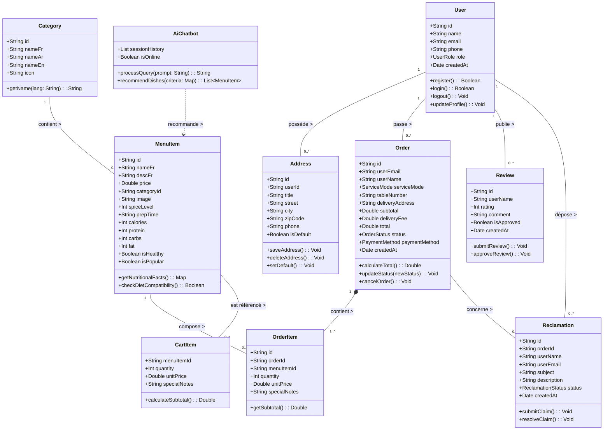

# 📐 Diagramme de Classe Général UML — Projet "Le Crispy / Malek"

Ce document présente le **Diagramme de Classe Général UML** du projet Le Crispy / Malek (Web & Mobile), conçu pour la section Conception / UML du rapport de **Projet de Fin d'Études (PFE)**.

---

## 📊 1. Représentation Graphique UML (Mermaid)

---

## 📝 2. Explications des Classes & Associations UML (Pour le Rapport)

### 🔹 1. Classe `User` (Utilisateur)
Représente un client ou un administrateur du système.
- **Attributs principaux** : `id`, `name`, `email`, `phone`, `role` (`customer` | `admin`).
- **Méthodes** : Authentification et gestion de profil.
- **Associations** :
  - Un utilisateur possède zéro ou plusieurs adresses de livraison (`0..*`).
  - Un utilisateur passe zéro ou plusieurs commandes (`0..*`).
  - Un utilisateur peut publier des avis (`0..*`) et soumettre des réclamations (`0..*`).

---

### 🔹 2. Classe `Address` (Adresse de livraison)
Stocke les adresses enregistrées par les clients pour le mode de dégustation *Livraison*.
- **Attributs** : `title` (ex: *Domicile*, *Bureau*), `street`, `city`, `zipCode`, `phone`, `isDefault`.

---

### 🔹 3. Classe `Category` (Catégorie de plat)
Organise le catalogue du restaurant.
- **Attributs** : Noms multilingues (`nameFr`, `nameAr`, `nameEn`), `icon`.
- **Association** : Une catégorie regroupe zéro ou plusieurs plats du menu (`0..*`).

---

### 🔹 4. Classe `MenuItem` (Plat du Menu)
Représente un produit/plat disponible à la carte.
- **Attributs** : Prix, image HD, caractéristiques nutritionnelles (`calories`, `protein`, `carbs`, `fat`), niveau d'épices (`spiceLevel`), et indicateurs diététiques (`isHealthy`, `isPopular`).
- **Association** : Appartient à une seule catégorie (`1`), et est référencé par les articles de panier et les lignes de commande.

---

### 🔹 5. Classe `Order` (Commande) & `OrderItem` (Composition)
Gère le cycle de vie d'une transaction client.
- **Attributs `Order`** : `serviceMode` (*Sur place*, *À emporter*, *Livraison*), `tableNumber`, `deliveryAddress`, `status` (`pending`, `preparing`, `ready`, `delivered`), `paymentMethod` (*Espèces*, *Carte*).
- **Relation de Composition** : Une commande est composée d'au moins une ou plusieurs lignes de commande `OrderItem` (`1..*`). Si la commande est supprimée, ses lignes associées sont également supprimées.

---

### 🔹 6. Classe `Review` (Avis Client) & `Reclamation` (Service Client)
- **`Review`** : Évaluation 5 étoiles avec commentaire laissée par le client.
- **`Reclamation`** : Ticket de réclamation lié à une commande spécifique (`orderId`) transmis à l'administration du restaurant.

---

### 🔹 7. Classe `AiChatbot` (Assistant Concierge IA)
Composant intelligent recommandant des plats de la classe `MenuItem` en fonction des besoins nutritionnels ou des préférences du client.
